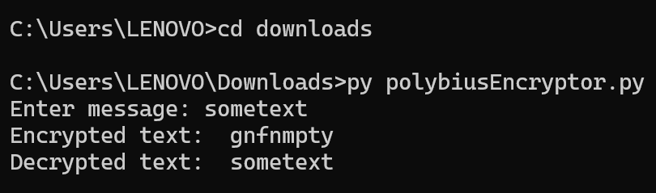

# Polybius Encryptor and Decryptor

## Description

### Developer

Lan-Anh Tran

### Program Purpose

This is a Python program capable of encrypting and decrypting a console input text based on the concept of the [Polybius square](https://en.wikipedia.org/wiki/Polybius_square).

### Acknowledgement

The initial solution for encrypting a text based on the Polybius square was provided by [AstroDestroyer146](https://youtu.be/wVC41DOnfZU). I added my own modification for the Polybius cube encryption and the solution for the decryption of an encrypted text.

## Installation

1. This Python script required Python already installed. See [this website](https://www.python.org/downloads/) for instructions to install Python 3.

2. After downloading the file, open Command Prompt and move into the directory of the file using the "cd" command.

3. Run the program using the command:

   ```py polybiusEncryptor.py```

4. Enter the text you wish to encrypt.

If you want to examine the encryption process, and how the coordinate sequence changes as the program runs, you can delete the '#' at the beginning of lines 90, 92, 97, and 99 in the Python code.



For more details on this program's underlying concepts and calculations, see [Documentation](Documentation.md).
